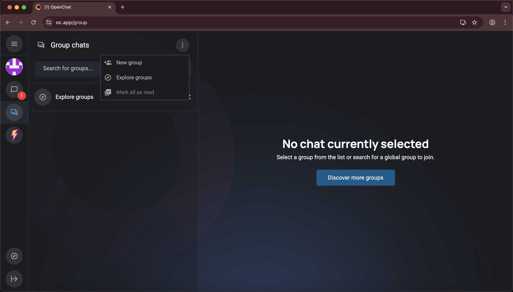
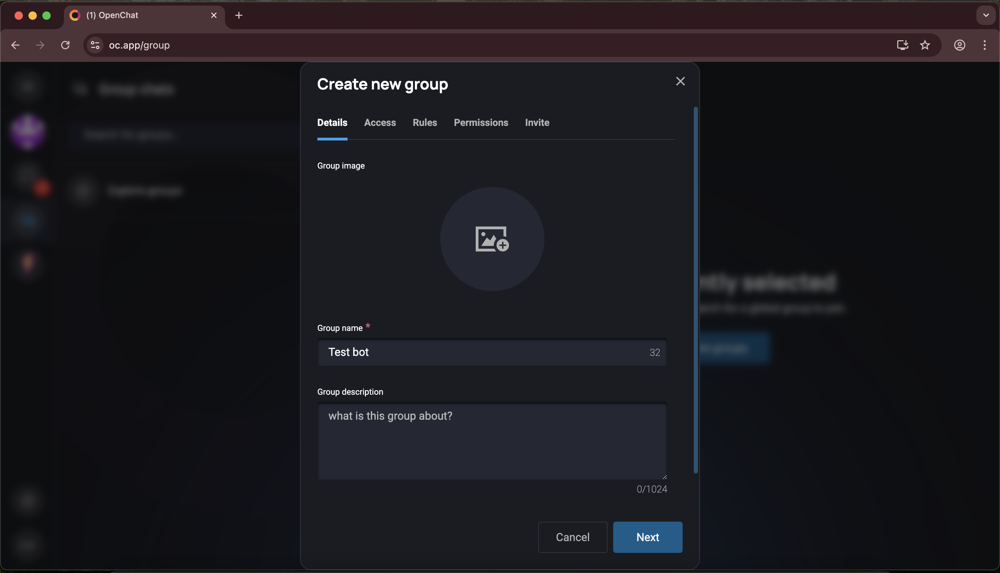
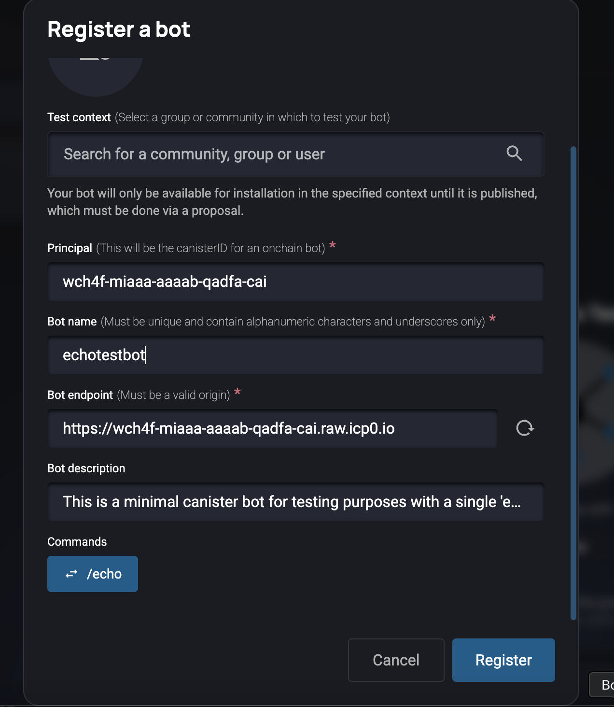
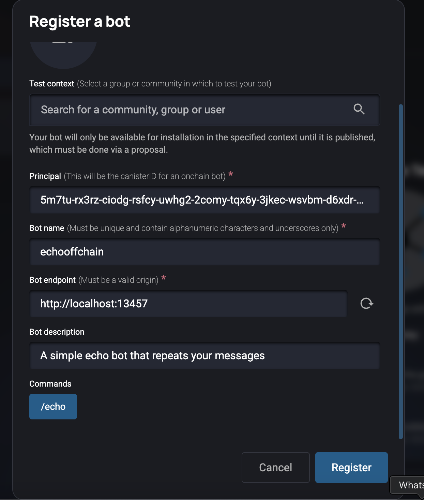
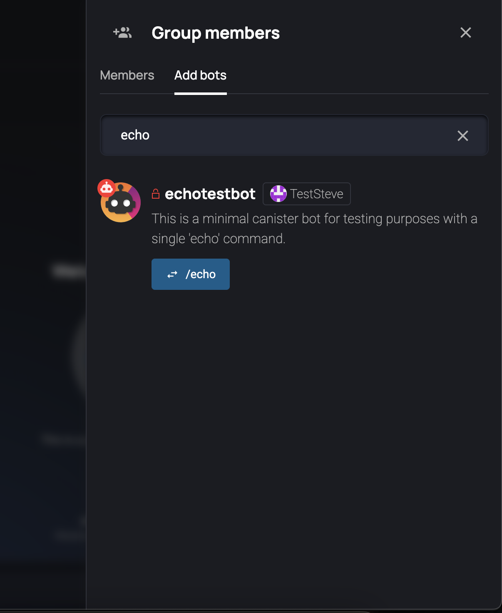
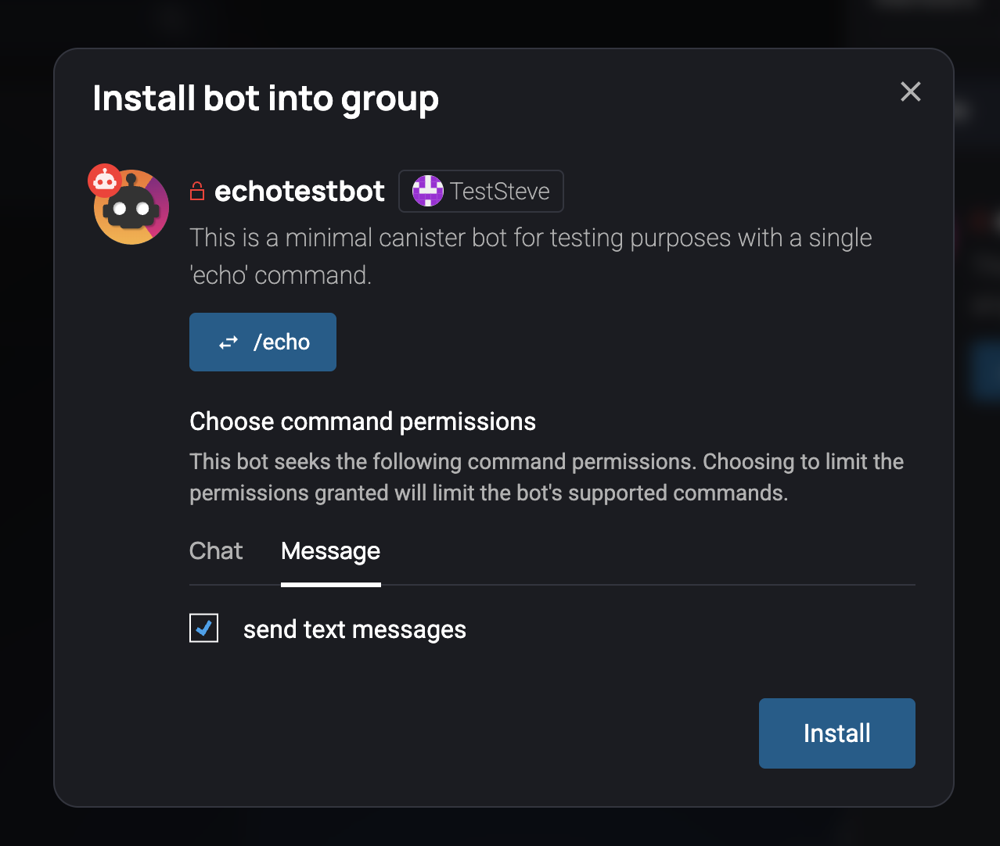
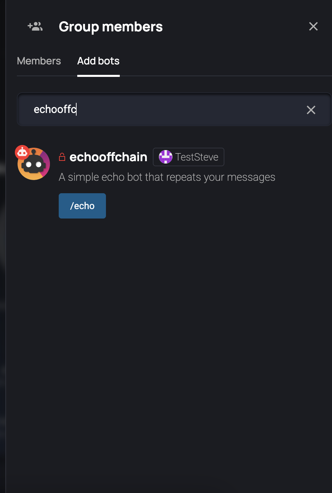
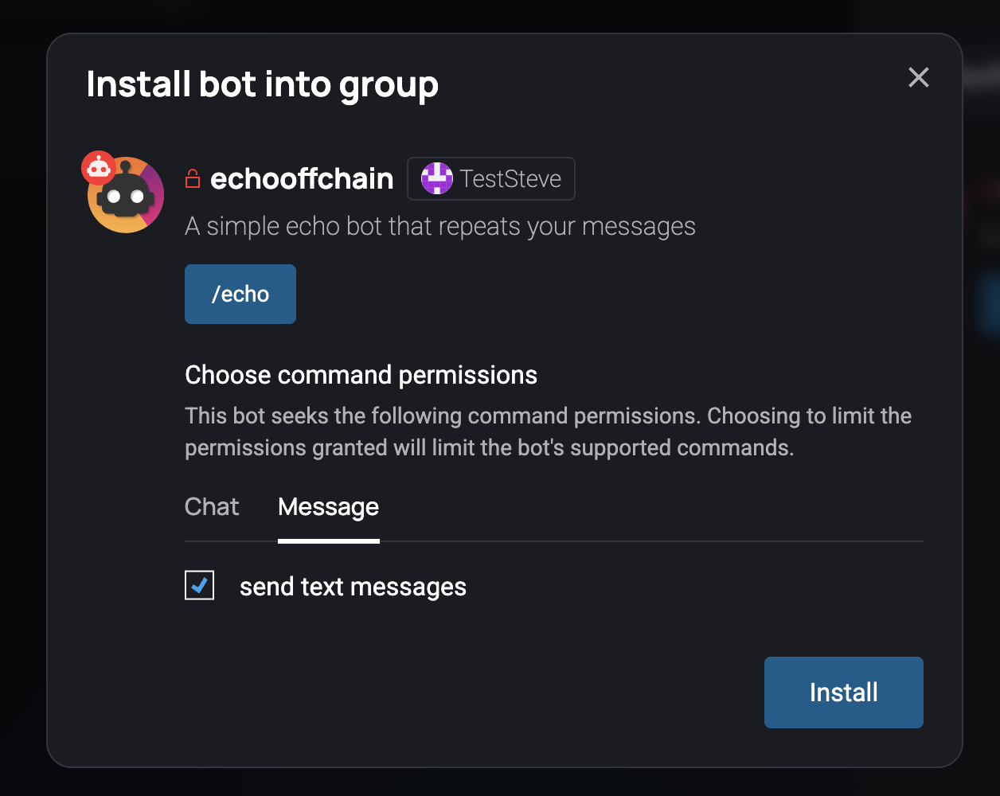
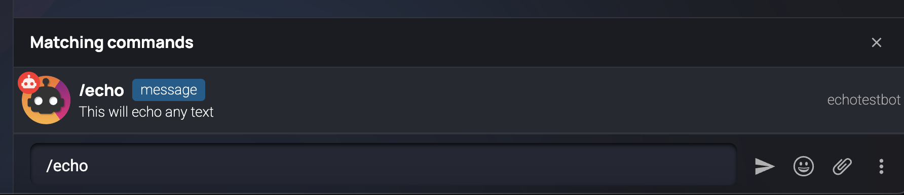
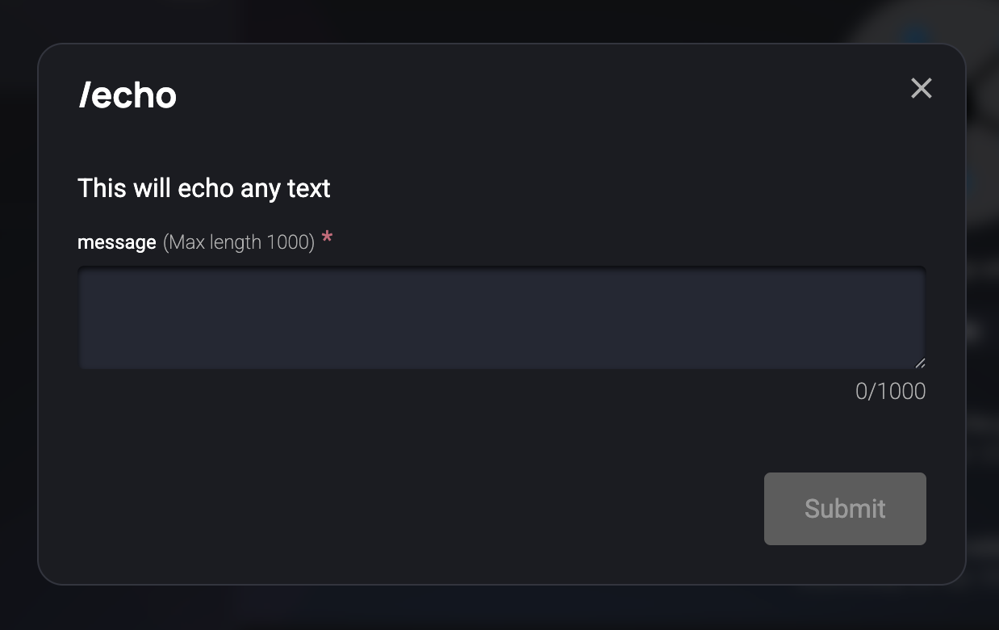

# Registering Your Bot

## Step 1: Sign Up and Access Communities
- Go to [oc.app/communities](https://oc.app/communities) and sign up if you haven't
- Once signed up, you'll see the communities page:

## Step 2: Create a Group
- Click on the `Group Chats` icon (3rd icon on the left sidebar)
- You'll be redirected to the group chat page
- Click on `New group` button to create a new group

## Step 3: Register Your Bot
- In your group, type the `/register-bot` command

#### Onchain Bot:
- A modal will appear where you need to enter:
  1. **Bot Principal**: The unique ID from your bot URL
     - Example: If your URL is `https://wch4f-miaaa-aaaab-qadfa-cai.raw.icp0.io/`
     - The principal is `wch4f-miaaa-aaaab-qadfa-cai`
  2. **Bot Name**: The name you gave your bot during registration
  3. **Bot URL**: The URL from the `./scripts/deploy_bot.sh` command output
     - Example: `https://wch4f-miaaa-aaaab-qadfa-cai.raw.icp0.io/`

#### Offchain Bot: 
- A modal will appear and you'll need to enter: 
   1. **Bot Principal**: gotten by running the command `dfx --identity bot_identity identity get-principal`
   2. **Bot Name**: The name you gave your bot during registration
   3. **Bot URL**: URL for the offchain bot will be `http://localhost:13457` since it's the URL the bot is running on. 

## Step 4: Install the Bot
- Click on the `members` icon (3rd icon from the right in the top navbar)

- Go to the `Add Bots` section
- Search for your registered bot
- Click on the bot and install it

#### Onchain Bot

#### Offchain Bot

## Step 5: Test the Bot
- Type the `/echo` command to test if the bot is working

