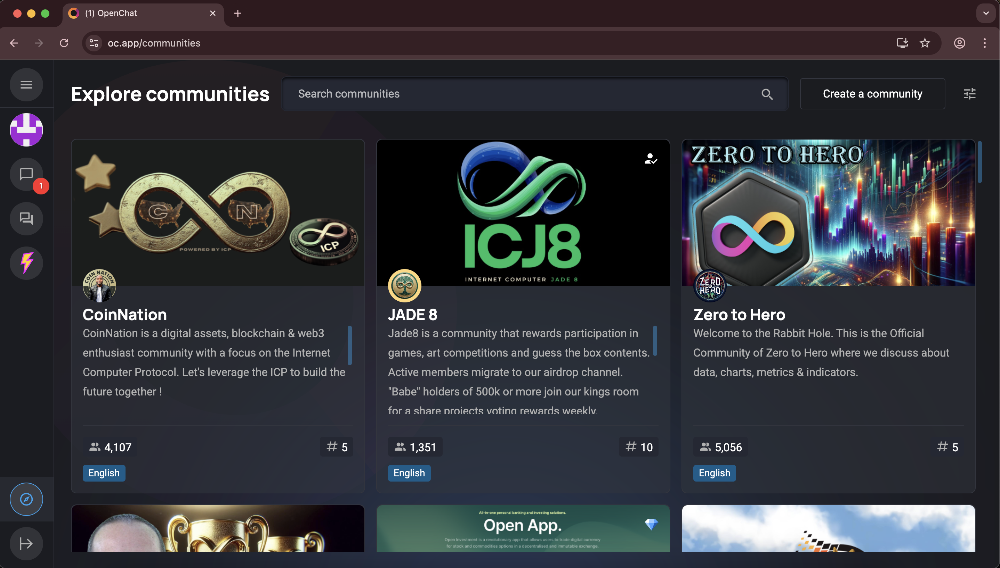
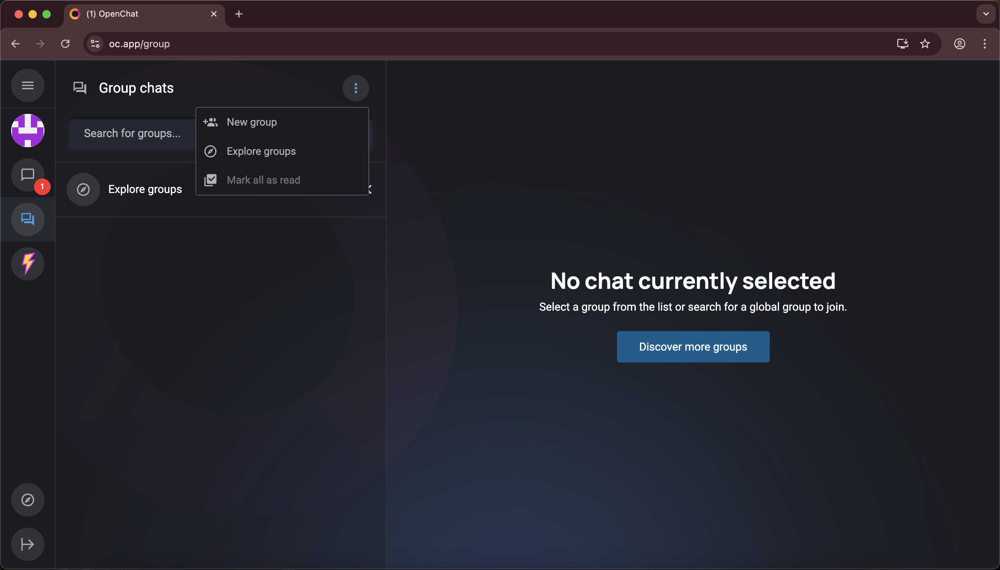
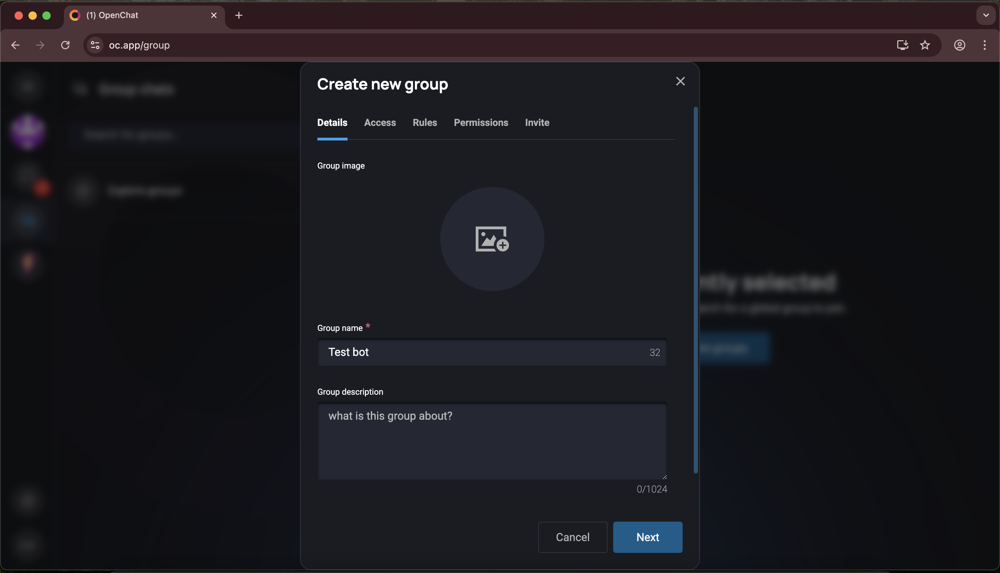
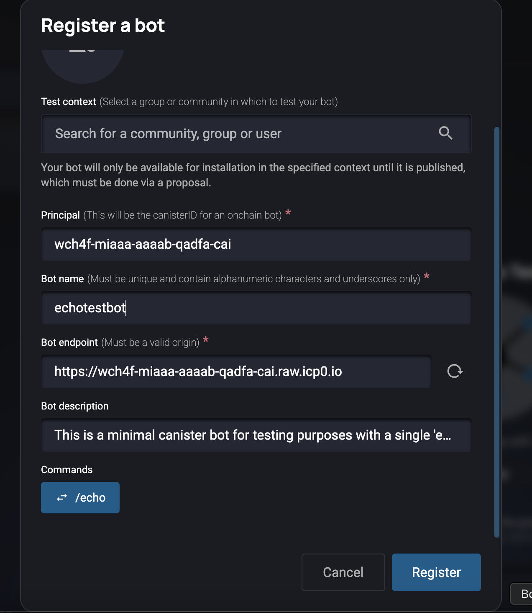
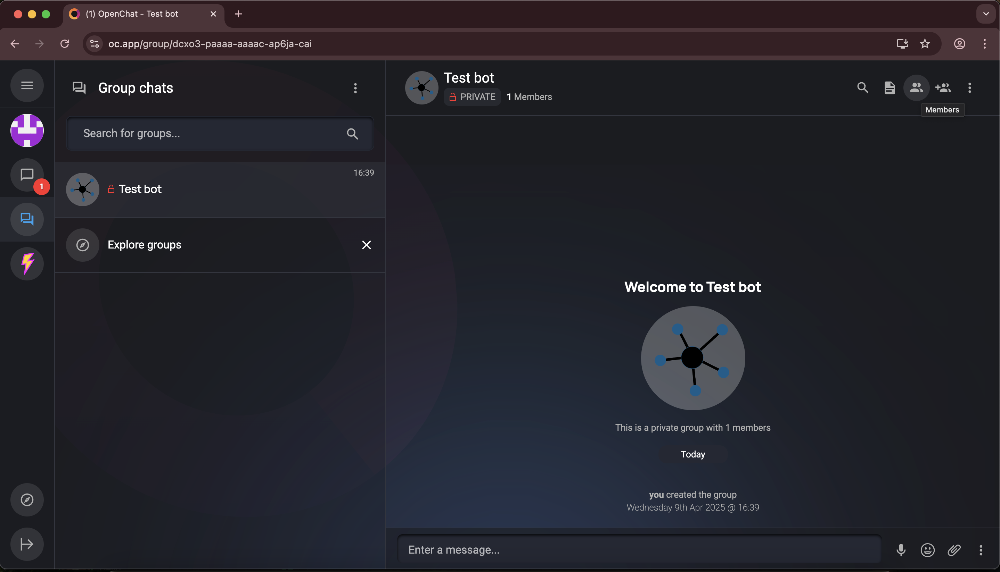
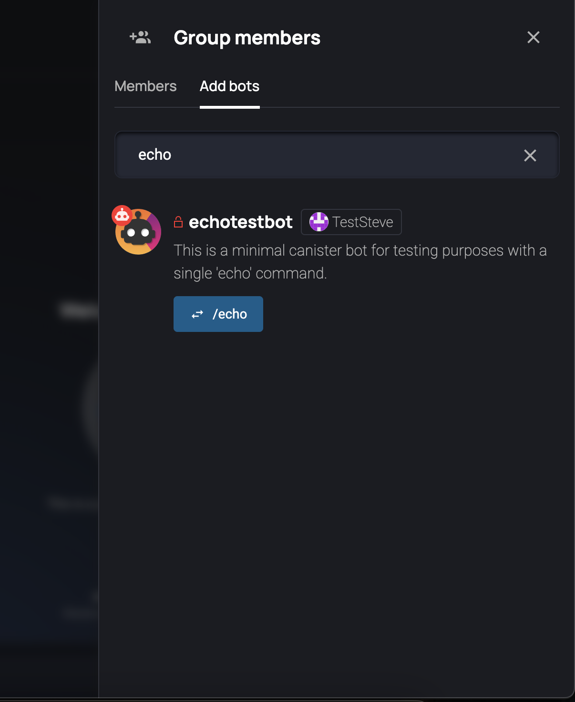
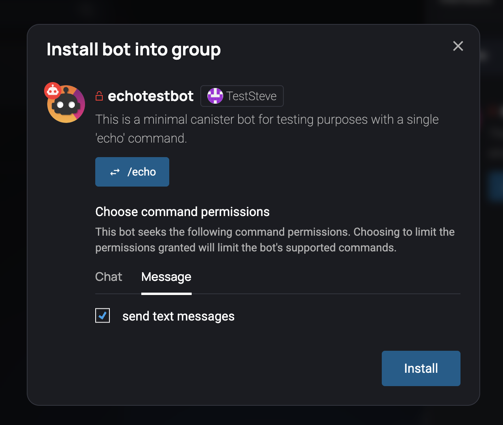
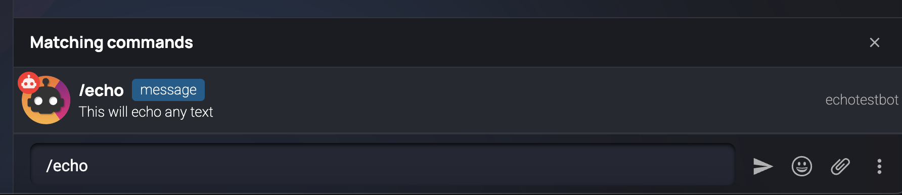
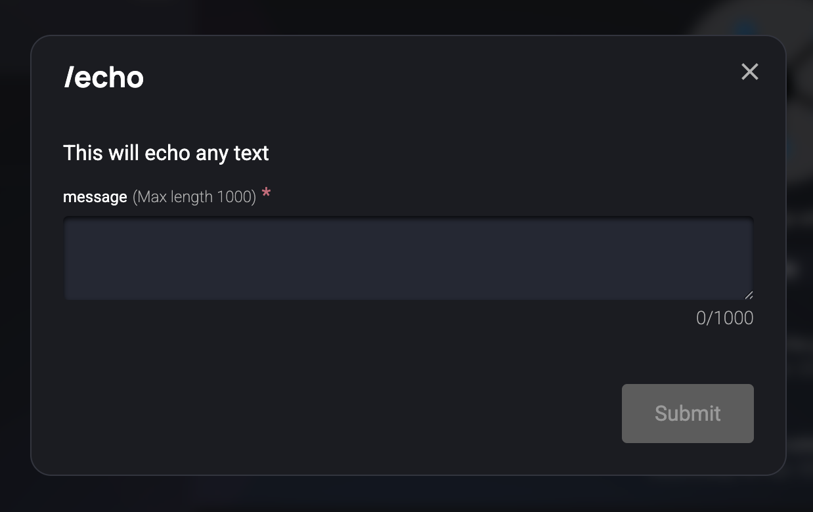

# Onchain Bot Example

This repository contains an example of an onchain bot built using the OpenChat Bot SDK. This guide will walk you through setting up, deploying, and understanding the bot.

## Getting Started

### Prerequisites
- [DFX](https://internetcomputer.org/docs/current/developer-docs/setup/install/) installed
- [Rust](https://www.rust-lang.org/tools/install) installed
- Git installed

### Step 1: Clone the Repository
```bash
git clone https://github.com/open-chat-labs/open-chat-bots.git
cd open-chat-bots/onchain-example
```

### Step 2: Deploy the Bot
The repository includes a deployment script that handles the entire deployment process. Simply run:
```bash
./scripts/deploy_bot.sh
```

This script will:
1. Build the bot
2. Deploy it to the Internet Computer playground network
3. Display the bot's URL and a curl command to test it

The deployment process is automatic and will handle:
- Creating a new canister if one doesn't exist
- Upgrading an existing canister if one is found
- Automatically falling back to creating a new canister if the existing one has expired (playground canisters expire after 20 minutes)

### Step 3: Register the Bot

1. **Sign Up and Access Communities**
   - Go to [oc.app/communities](https://oc.app/communities) and sign up if you haven't
   - Once signed up, you'll see the communities page:
   

2. **Create a Group**
   - Click on the `Group Chats` icon (3rd icon on the left sidebar)
   - You'll be redirected to the group chat page
   - Click on `New group` button to create a new group
   
   

3. **Register Your Bot**
   - In your group, type the `/register-bot` command
   - A modal will appear where you need to enter:
     1. **Bot Principal**: The unique ID from your bot URL
        - Example: If your URL is `https://wch4f-miaaa-aaaab-qadfa-cai.raw.icp0.io/`
        - The principal is `wch4f-miaaa-aaaab-qadfa-cai`
     2. **Bot Name**: The name you gave your bot during registration
     3. **Bot URL**: The URL from the `./scripts/deploy_bot.sh` command output
        - Example: `https://wch4f-miaaa-aaaab-qadfa-cai.raw.icp0.io/`
   

4. **Install the Bot**
   - Click on the `members` icon (3rd icon from the right in the top navbar)
   
   - Go to the `Add Bots` section
   - Search for your registered bot
   - Click on the bot and install it
   
   

5. **Test the Bot**
   - Type the `/echo` command to test if the bot is working
   
   

And that's how you deploy, register and run your bot!

Now let's understand how the different code logic of the bot works.

## Understanding the Deploy Script

The deployment process is handled by two main scripts: `deploy_bot.sh` and `utils/deploy.sh`. Let's examine each script in detail:

### deploy_bot.sh

This is the main deployment script that orchestrates the entire deployment process. Here's a detailed breakdown:

```bash
# Set default values
MODE=${1:-upgrade} # MODE is either install, reinstall or upgrade
NETWORK=${2:-playground} # NETWORK is either playground or local

# ANSI color codes for better output visibility
GREEN='\033[0;32m'
BLUE='\033[0;34m'
NC='\033[0m' # No Color
```
The script starts by setting default values for the deployment mode and network, and defines color codes for terminal output.

```bash
# Read the OpenChat public key from the website
OC_PUBLIC_KEY=$(curl -s https://oc.app/public-key)

# Build the bot install args
ARGS="(record { oc_public_key = \"$OC_PUBLIC_KEY\" } )"
```
It fetches the OpenChat public key and formats it into the required argument structure for the canister.

```bash
# Generate Cargo.lock file first
echo "Generating Cargo.lock file..."
cd ..
cargo build --target wasm32-unknown-unknown || exit 1
cd $SCRIPT_DIR
```
This section builds the bot for the WebAssembly target.

The most important part is the playground deployment logic:
```bash
if [ "$NETWORK" = "playground" ]; then
    echo "Deploying to playground network..."
    
    # Try to get the canister ID to check if it exists
    CANISTER_ID=$(dfx canister id onchain_bot --network playground 2>/dev/null)
    
    if [ $? -eq 0 ] && [ ! -z "$CANISTER_ID" ]; then
        echo "Canister exists. Attempting upgrade..."
        # Try to upgrade first
        if ! dfx deploy onchain_bot --playground --argument "$ARGS" --mode upgrade; then
            echo "Upgrade failed. The canister might have expired. Creating a new one..."
            # If upgrade fails, create a new canister
            dfx deploy onchain_bot --playground --argument "$ARGS" --mode install
        fi
    else
        echo "Canister does not exist. Creating a new one..."
        # Create a new canister
        dfx deploy onchain_bot --playground --argument "$ARGS" --mode install
    fi
```
This code:
1. Checks if the canister exists
2. If it exists, attempts to upgrade it
3. If the upgrade fails (likely due to expiration), creates a new canister
4. If it doesn't exist, creates a new canister

### utils/deploy.sh

This utility script handles the lower-level deployment process. Here's its key components:

```bash
BOT=$1
NAME=$2
MODE=$3
ARGS=$4
NETWORK=${5:-local} # Default to local network
```
The script accepts five parameters: bot name, display name, mode, arguments, and network.

```bash
if [ $MODE = "install" ]
then
    echo "Installing $BOT"
    # Create a canister for the bot locally
    dfx canister create --quiet $BOT --no-wallet --network $NETWORK || exit 1
fi
```
This section creates a new canister if we're in install mode.

```bash
# Get the canister ID
CANISTER_ID=$(dfx canister id $BOT --network $NETWORK) || exit 1
echo "Canister ID: $CANISTER_ID"

# Build the bot WASM
echo "Building $BOT WASM"
dfx build --quiet $BOT --check --network $NETWORK || exit 1

# Install/reinstall/upgrade the $BOT canister
echo "Installing $BOT"
dfx canister install --quiet --mode $MODE $BOT --argument "$ARGS" --network $NETWORK || exit 1
```
This section:
1. Gets the canister ID
2. Builds the WebAssembly module
3. Installs the module to the canister with the specified mode

```bash
# Return the URL of the $BOT
echo ""
echo "Name: $NAME"
echo "Principal: $CANISTER_ID"
if [ "$NETWORK" = "playground" ]; then
    echo "Bot URL: https://$CANISTER_ID.raw.icp0.io/"
    echo "Note: The bot is accessible via the URL above. Make sure to include the '?id=' parameter with your canister ID."
else
    echo "Endpoint: http://$CANISTER_ID.raw.localhost:8080"
fi
```
Finally, it displays the appropriate URL based on the network type.

### Key Features

1. **Automatic Mode Selection**
   - The script automatically determines whether to install or upgrade based on canister existence
   - Handles expired canisters gracefully by creating new ones

2. **Network Support**
   - Supports both playground and local networks
   - Uses appropriate flags and URLs for each network

3. **Error Handling**
   - Gracefully handles canister expiration
   - Provides clear error messages
   - Automatically falls back to creating new canisters when needed

4. **User-Friendly Output**
   - Color-coded output for better visibility
   - Clear instructions for testing the bot
   - Warning about playground canister expiration

## Understanding the Code Structure

The onchain bot example follows a modular Rust project structure designed for Internet Computer canisters. Here's the complete structure:

```
onchain-example/
├── scripts/                    # Deployment scripts
│   ├── deploy_bot.sh          # Main deployment script
│   └── utils/
│       └── deploy.sh          # Utility deployment script
├── src/                       # Source code
│   ├── router/               # Command routing and handling
│   │   ├── commands/         # Individual command implementations
│   │   │   └── echo.rs       # Echo command implementation
│   │   ├── commands.rs       # Command registry and execution
│   │   └── definition.rs     # Bot definition and metadata
│   ├── lib.rs                # Main canister entry points
│   ├── memory.rs             # Memory management for upgrades
│   ├── router.rs             # HTTP request routing
│   └── state.rs              # State management
├── can.did                    # Candid interface definition
├── Cargo.toml                # Rust dependencies and configuration
├── dfx.json                  # DFX configuration
├── README.md                 # This documentation
└── rust-toolchain.toml       # Rust toolchain version
```

### Key Components

#### 1. Cargo.toml
```toml
[package]
name = "onchain_bot"
version = "0.1.0"
edition = "2021"
description = "A boilerplate for creating onchain bots on the Internet Computer"
authors = ["Your Name <your.email@example.com>"]
license = "MIT"

[lib]
path = "src/lib.rs"
crate-type = ["cdylib"]

[dependencies]
async-trait = "0.1.77"
oc_bots_sdk = { git = "https://github.com/open-chat-labs/open-chat-bots.git", branch = "main" }
oc_bots_sdk_canister = { git = "https://github.com/open-chat-labs/open-chat-bots.git", branch = "main" }
candid = "0.10.13"
getrandom = { version = "0.2.15", features = ["custom"] }
http = "1.0.0"
ic-cdk = { version = "0.17.1" }
ic-http-certification = "2.6.0"
ic_principal = "0.1.0"
ic-stable-structures = "0.6.8"
rmp-serde = "1.1.2"
serde = { version = "1.0.193", features = ["derive"] }
serde_json = "1.0.108"
```
This configuration:
- Defines the project as a canister (cdylib)
- Links to the OpenChat Bot SDK from GitHub
- Includes necessary Internet Computer dependencies
- Sets up serialization and HTTP handling

#### 2. src/lib.rs
This is the main entry point for the canister, containing:
- Canister initialization and upgrade hooks
- HTTP request handling endpoints
- State management setup

#### 3. src/router/
This directory contains the bot's command handling logic:

##### commands/echo.rs
```rust
use async_trait::async_trait;
use oc_bots_sdk::api::command::{CommandHandler, SuccessResult};
use oc_bots_sdk::api::definition::*;
use oc_bots_sdk::oc_api::actions::send_message;
use oc_bots_sdk::oc_api::client::Client;
use oc_bots_sdk::types::BotCommandContext;
use oc_bots_sdk_canister::CanisterRuntime;

pub struct Echo;

#[async_trait]
impl CommandHandler<CanisterRuntime> for Echo {
    fn definition(&self) -> &BotCommandDefinition {
        &DEFINITION
    }

    async fn execute(
        &self,
        oc_client: Client<CanisterRuntime, BotCommandContext>,
    ) -> Result<SuccessResult, String> {
        let text = oc_client.context().command.arg("message");
        let message = oc_client
            .send_text_message(text)
            .with_block_level_markdown(true)
            .execute_then_return_message(|args, response| {
                // Handle response
            });

        Ok(SuccessResult { message })
    }
}
```
This implements the echo command using the OpenChat Bot SDK.

##### commands.rs
Manages the command registry and execution:
- Registers available commands
- Handles command routing
- Manages command execution context

##### definition.rs
Defines the bot's metadata and available commands:
- Bot description
- Command definitions
- Command parameters and permissions

#### 4. src/state.rs
Manages the canister's persistent state:
- Stores the OpenChat public key
- Handles state initialization and updates
- Provides thread-safe state access

#### 5. src/memory.rs
Handles memory management for canister upgrades:
- Manages stable memory
- Handles serialization/deserialization
- Ensures state persistence across upgrades

### Bot Functionality

The example bot implements a simple echo command that:
1. Accepts a message parameter
2. Sends the message back to the user
3. Supports markdown formatting
4. Handles errors gracefully

The code structure follows these principles:
- Modular command implementation
- Clear separation of concerns
- Thread-safe state management
- Proper error handling
- Upgrade-safe design

### Extending the Bot

To add new commands:
1. Create a new file in `src/router/commands/`
2. Implement the `CommandHandler` trait
3. Define the command's parameters and permissions
4. Register the command in `commands.rs`
5. Update the bot definition in `definition.rs`

You can now build you own custom made onchain bot using this template by adding new commands and logic. 
